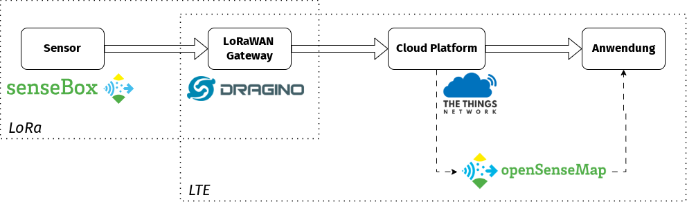

# Übersicht 

## Step by Step: Eine Sensebox im Netzwerk einrichten

1. Sensebox zusammenbauen
2. Sensebox im TheThingsNetwork anmelden
    a) Eine DevEUID erzeugen.
    b) Die AppEUID auf 0 setzten.
    c) Einen AppKey erzeugen.
3. Die erzeugten IDs und Keys in der Sensebox Software eintragen
4. Messdaten über CayenneLPP Nachricht versenden
5. Sensebox auf OpenSenseMap anmelden

**Links**
> [Sensebox Dokumentation: LoRa](https://docs.sensebox.de/docs/products/home/erweiterungen/home-erweiterung-LoRa)

> [Einführung in LoRaWAN](lora.md)

