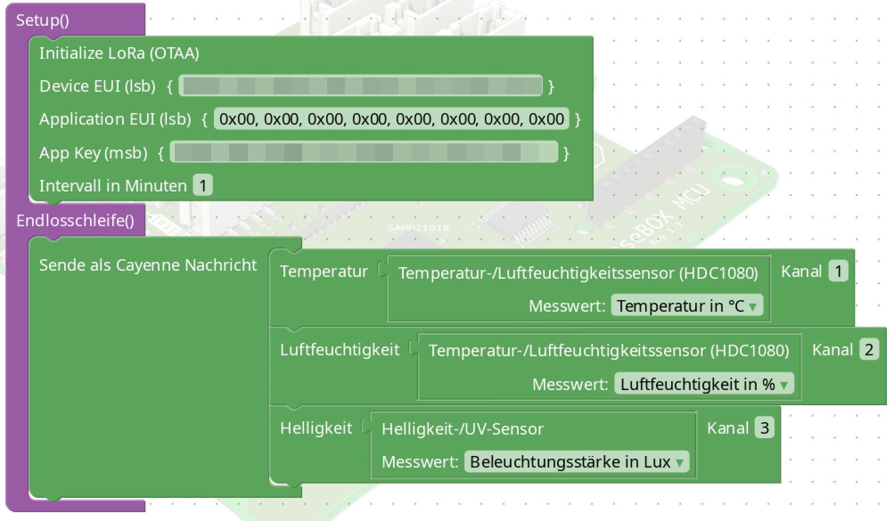

# Sensebox Blockly LoRa





```cpp
// Code generated by senseBox Blockly on Mon Jul 21 2025 14:09:58 GMT+0200 (Central European Summer Time)

#include <senseBoxIO.h>
#include <SPI.h>
#include <lmic.h> // http://librarymanager/All#IBM_LMIC_framework
#include <hal/hal.h>
#include <CayenneLPP.h> // http://librarymanager/All#CayenneLPP
#include <Adafruit_HDC1000.h> // http://librarymanager/All#Adafruit_HDC1000_Library
#include <LTR329.h>
#include <Wire.h>

CayenneLPP lpp(51);

static const u1_t PROGMEM APPEUI[8]= {0x00, 0x00, 0x00, 0x00, 0x00, 0x00, 0x00, 0x00};
void os_getArtEui (u1_t* buf) { memcpy_P(buf, APPEUI , 8);}

static const u1_t PROGMEM DEVEUI[8]= {};
void os_getDevEui (u1_t* buf) { memcpy_P(buf, DEVEUI , 8);}

// This key should be in big endian format (or, since it is not really a
// number but a block of memory, endianness does not really apply). In
// practice, a key taken from ttnctl can be copied as-is.
// The key shown here is the semtech default key.
static const u1_t PROGMEM APPKEY[16] = {};
void os_getDevKey (u1_t* buf) {  memcpy_P(buf, APPKEY , 16);}

static osjob_t sendjob;

// Schedule TX every this many seconds (might become longer due to duty
// cycle limitations).
const unsigned TX_INTERVAL = 60;

// Pin mapping
const lmic_pinmap lmic_pins = {
  .nss = PIN_XB1_CS,
  .rxtx = LMIC_UNUSED_PIN,
  .rst = LMIC_UNUSED_PIN,
  .dio = {PIN_XB1_INT, PIN_XB1_INT, LMIC_UNUSED_PIN},
};
Adafruit_HDC1000 hdc = Adafruit_HDC1000();

bool lightsensortype = 0; //0 for tsl - 1 for ltr
//settings for LTR sensor
LTR329 LTR;
unsigned char gain = 1;
unsigned char integrationTime = 0;
unsigned char measurementRate = 3;

void initLora() {
  delay(2000);
  // LMIC init
  os_init();
  // Reset the MAC state. Session and pending data transfers will be discarded.
  LMIC_reset();

  // Start job (sending automatically starts OTAA too)
  do_send(&sendjob);
}

void onEvent (ev_t ev) {
  Serial.print(os_getTime());
  Serial.print(": ");
  switch(ev) {
    case EV_SCAN_TIMEOUT:
    Serial.println(F("EV_SCAN_TIMEOUT"));
    break;
    case EV_BEACON_FOUND:
    Serial.println(F("EV_BEACON_FOUND"));
    break;
    case EV_BEACON_MISSED:
    Serial.println(F("EV_BEACON_MISSED"));
    break;
    case EV_BEACON_TRACKED:
    Serial.println(F("EV_BEACON_TRACKED"));
    break;
    case EV_JOINING:
    Serial.println(F("EV_JOINING"));
    break;
    case EV_JOINED:
    Serial.println(F("EV_JOINED"));

    // Disable link check validation (automatically enabled
    // during join, but not supported by TTN at this time).
    LMIC_setLinkCheckMode(0);
    break;
    case EV_RFU1:
    Serial.println(F("EV_RFU1"));
    break;
    case EV_JOIN_FAILED:
    Serial.println(F("EV_JOIN_FAILED"));
    break;
    case EV_REJOIN_FAILED:
    Serial.println(F("EV_REJOIN_FAILED"));
    break;
    break;
    case EV_TXCOMPLETE:
    Serial.println(F("EV_TXCOMPLETE (includes waiting for RX windows)"));
    if (LMIC.txrxFlags & TXRX_ACK)
    Serial.println(F("Received ack"));
    if (LMIC.dataLen) {
      Serial.println(F("Received "));
      Serial.println(LMIC.dataLen);
      Serial.println(F(" bytes of payload"));
    }
    // Schedule next transmission
    os_setTimedCallback(&sendjob, os_getTime()+sec2osticks(TX_INTERVAL), do_send);
    break;
    case EV_LOST_TSYNC:
    Serial.println(F("EV_LOST_TSYNC"));
    break;
    case EV_RESET:
    Serial.println(F("EV_RESET"));
    break;
    case EV_RXCOMPLETE:
    // data received in ping slot
    Serial.println(F("EV_RXCOMPLETE"));
    break;
    case EV_LINK_DEAD:
    Serial.println(F("EV_LINK_DEAD"));
    break;
    case EV_LINK_ALIVE:
    Serial.println(F("EV_LINK_ALIVE"));
    break;
    default:
    Serial.println(F("Unknown event"));
    break;
  }
}

int read_reg(byte address, uint8_t reg)
{
  int i = 0;
  Wire.beginTransmission(address);
  Wire.write(reg);
  Wire.endTransmission();
  Wire.requestFrom((uint8_t)address, (uint8_t)1);
  delay(1);
  if(Wire.available())
  i = Wire.read();
  return i;
}

void write_reg(byte address, uint8_t reg, uint8_t val)
{
  Wire.beginTransmission(address);
  Wire.write(reg);
  Wire.write(val);
  Wire.endTransmission();
}

void Lightsensor_begin()
{
  unsigned int u = 0;
  u = read_reg(0x29, 0x80 | 0x0A); //id register
  if ((u & 0xF0) == 0xA0)            // TSL45315
  {
    write_reg(0x29, 0x80 | 0x00, 0x03); //control: power on
    write_reg(0x29, 0x80 | 0x01, 0x02); //config: M=4 T=100ms
    delay(120);
    lightsensortype = 0; //TSL45315
  }
  else
  {
    LTR.begin();
    LTR.setControl(gain, false, false);
    LTR.setMeasurementRate(integrationTime, measurementRate);
    LTR.setPowerUp(); //power on with default settings
    delay(10); //Wait 10 ms (max) - wakeup time from standby
    lightsensortype = 1;                     //
  }
}

uint32_t Lightsensor_getIlluminance()
{
  unsigned int lux = 0;
  if (lightsensortype == 0) // TSL45315
  {
    unsigned int u = (read_reg(0x29, 0x80 | 0x04) << 0);  //data low
    u |= (read_reg(0x29, 0x80 | 0x05) << 8); //data high
    lux = u * 4; // calc lux with M=4 and T=100ms
  }
  else if (lightsensortype == 1) //LTR-329ALS-01
  {
    delay(100);
    unsigned int data0, data1;
    for (int i = 0; i < 5; i++) {
      if (LTR.getData(data0, data1)) {
        if(LTR.getLux(gain, integrationTime, data0, data1, lux));
        if(lux > 0) break;
        else delay(10);
      }
      else {
        byte error = LTR.getError();
      }
    }
  }
  return lux;
}

void do_send(osjob_t* j){
  // Check if there is not a current TX/RX job running
  if (LMIC.opmode & OP_TXRXPEND) {
    Serial.println(F("OP_TXRXPEND, not sending"));
  } else {
    lpp.reset();
    lpp.addTemperature(1, hdc.readTemperature());
    lpp.addRelativeHumidity(2, hdc.readHumidity());
    lpp.addLuminosity(3, Lightsensor_getIlluminance());

    // Prepare upstream data transmission at the next possible time.
    LMIC_setTxData2(1, lpp.getBuffer(), lpp.getSize(), 0);
    Serial.println(F("Packet queued"));
  }
  // Next TX is scheduled after TX_COMPLETE event.
}

void setup() {
  Wire.begin();

  Serial.begin(9600);
  delay(1000);

  hdc.begin();
  Lightsensor_begin();

  initLora();

}

void loop() {
  os_runloop_once();

}
```